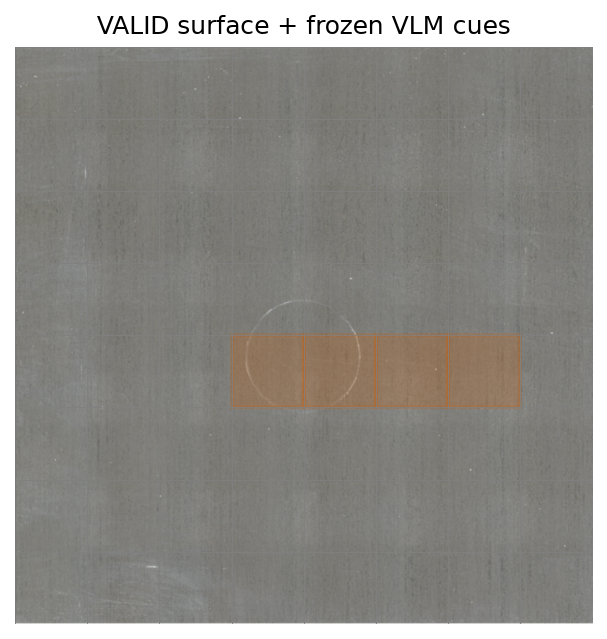
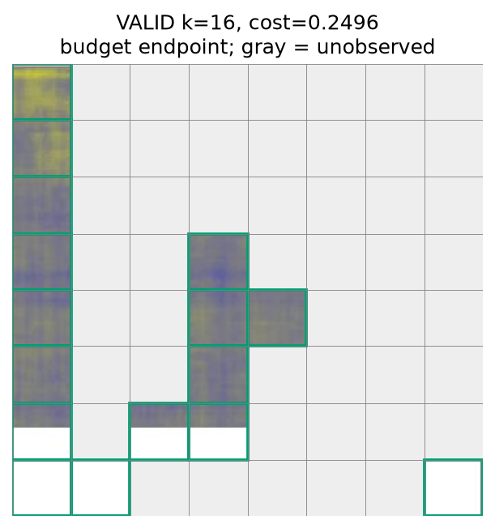
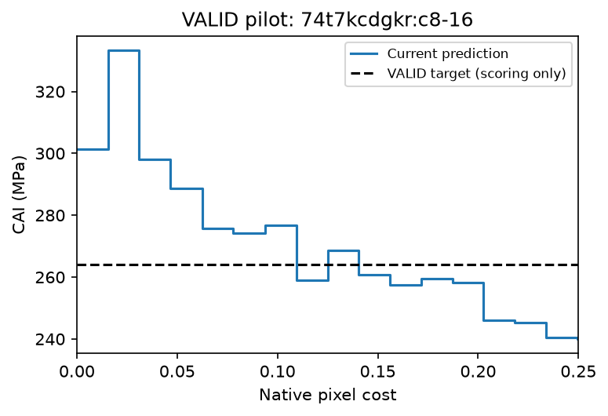
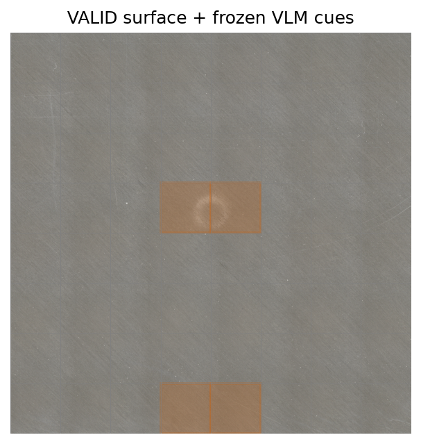
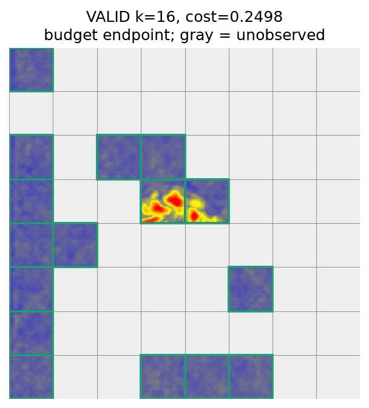
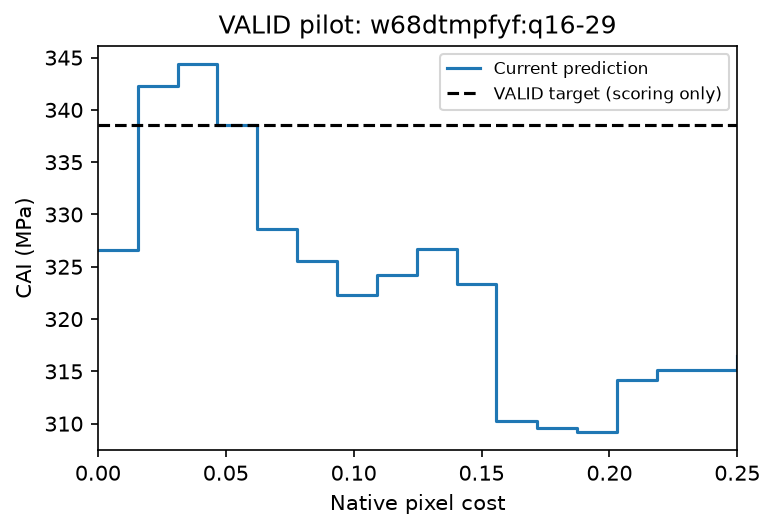
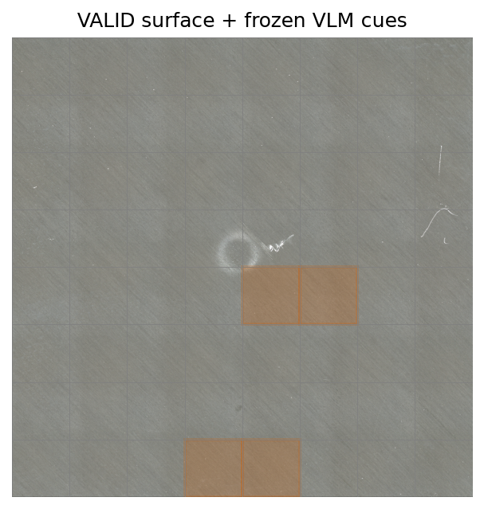
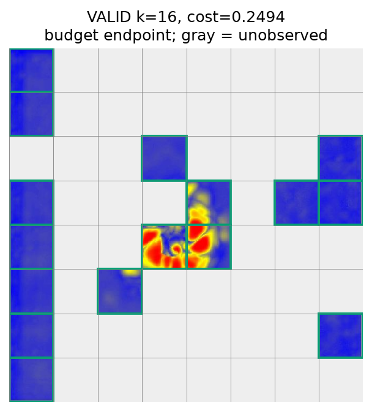
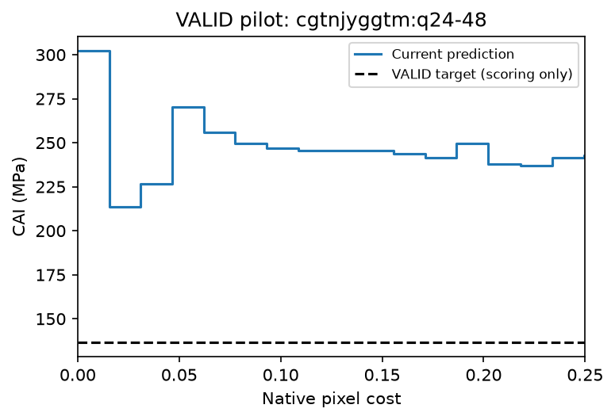

# Supplementary material

Learning what to inspect: Task-driven multimodal C-scan acquisition for compression-after-impact assessment

Supplement to the offline validation study on 50 physical specimens, 48 capture groups and six domains.

## S1 Data provenance and reproducibility

Surface and internal images come from six version-1 post-impact datasets; the CAI-strength source is the version-3 compression-after-impact dataset. Original records are published under CC BY 4.0. The study's registered crops, overlays and feature representations are derived assets, and their release requires correct attribution and author confirmation of the intended release scope. Source version and specimen correspondence are recorded independently of filenames; a layer count is not used to infer a per-specimen thickness. In particular, photographs taken after compression in the CAI dataset are not substituted for the post-impact surface input.

The source authors are Saki Hasebe, Ryo Higuchi, Tomohiro Yokozeki and Shin-ichi Takeda. The image and mechanical datasets are described in their Data in Brief articles [@hasebe2022data; @hasebe2025data]. Table S1 maps the exact dataset versions. The local cohort contains 276 specimens in 259 source-related capture groups, split as 161/152 TRAIN, 50/48 VALID and 65/59 reserved TEST physical specimens/groups. The reserved TEST partition was not evaluated.

| Domain | Configuration verified from source record | Version / DOI |
|---|---|---|
| 74t7kcdgkr | 8-layer cross-ply | v1, 10.17632/74t7kcdgkr.1 [@data_74t7kcdgkr] |
| yfxyg8jm46 | 16-layer cross-ply | v1, 10.17632/yfxyg8jm46.1 [@data_yfxyg8jm46] |
| xcmzfsbd9t | 24-layer cross-ply | v1, 10.17632/xcmzfsbd9t.1 [@data_xcmzfsbd9t] |
| ykhs7s2dck | 8-layer quasi-isotropic | v1, 10.17632/ykhs7s2dck.1 [@data_ykhs7s2dck] |
| w68dtmpfyf | 16-layer quasi-isotropic | v1, 10.17632/w68dtmpfyf.1 [@data_w68dtmpfyf] |
| cgtnjyggtm | 24-layer quasi-isotropic | v1, 10.17632/cgtnjyggtm.1 [@data_cgtnjyggtm] |
| CAI measurement source | Compression-after-impact strength workbook | v3, 10.17632/8scdmfdcfb.3 [@data_cai] |

**Table S1. Source mapping.** The six image domains use impacted-surface views and registered internal-image crops. Labels use the author workbook's CAI_STRENGTH field in MPa, not impact energy, delamination area or normalized strength reduction.

The predictor uses frozen 64×512 surface and internal descriptors, 64-dimensional projections and cell representations, and all-cell plus measured-cell pooling. The spatial actor uses 128-dimensional tokens, two encoder layers, four attention heads, a 256-dimensional feed-forward block and zero actor attention dropout. The query and 64 cells are processed together. The mean-feedback actor has 91,650 parameters, compared with 378,978 for each spatial actor and 64 for learned-static. No capacity-matched interpretation is intended.

| Predictor training item | Saved setting |
|----------------------------|----------------------------------------------------|
| Supervision | CAI strength in MPa; mean Huber loss of $(\hat y-y)/s$ against zero, delta 1 |
| Residual and output normalization | Fit-target mean; $s=\max(\operatorname{std}(y_{\mathrm{fit}}),1\,\mathrm{MPa})$; OOF constants fitted separately |
| Batch / specimen sampling | 32; uniform domain, then uniform physical specimen within domain |
| Mask sampling probabilities | 10% zero; 60% 1–16 cells; 20% 17–48 cells; 10% full 64 |
| Partial-mask routes | 1–16: Random/Center-first/Geometry-spread/Serpentine prefixes; 17–48: random permutation |
| Optimizer / learning rate / weight decay | AdamW / 0.0003 / 0.0001 |
| Gradient-norm clipping | 1 |
| Maximum updates / validation interval / patience | 2000 / 250 / 4; checkpoint improvement tolerance $10^{-12}$ |
| Common candidate seeds | MEAN_SC 2026091201; SPATIAL_SC 2026091202; SPATIAL_C 2026091203 |
| Common selected / completed updates | MEAN_SC 1750/2000; SPATIAL_SC 750/1750; SPATIAL_C 500/1500 |
| Validation library | Zero state and affordable prefixes of four fixed routes on the same 50 VALID specimens; budget 0.25 |
| Selection measure | Route mean within specimen, specimen mean within domain, equal mean over six domains of A |
| Candidate choice | Minimum eligible validation area; ties within $10^{-8}$ use fewer parameters, then name |
| OOF seeds / selected updates | 2026091211–2026091213 / 1250, 750, 1000 |
| OOF completed updates | 2000, 1750, 2000 |
| OOF fit / query physical counts | 104/57, 108/53, 110/51; no fit/query capture-group overlap |

**Predictor-specific settings.** Mask probabilities describe independent random draws, not enforced batch counts. Each source-related training group is assigned to one of three folds within its domain, with groups kept intact. A query specimen uses the predictor fitted outside its fold. The validation library is shared for checkpoint selection, including OOF models; group exclusion from fitting does not imply independent checkpoint validation. Fixed-route validation prefixes are distinct from the later actor trajectories.

Eligibility required finite metrics; full-input MAE below the fit-median constant predictor, full-input MSE below the fit-mean constant predictor, and at least 2% lower full-input MAE than zero-input MAE. Center-first and Geometry-spread endpoint MAEs also had to improve on zero-input MAE. Constants are computed from fitting labels and evaluated on VALID. All three common candidates satisfied these checks before their validation areas were compared.

Native cell costs and the legal acquisition test use float64 arithmetic with tolerance $10^{-12}$ at budget 0.25. The feature-model cost channel is float32, while legal decisions retain native float64 costs. After an action, cost is the sum of measured-cell costs and history at that cell is its one-based acquisition step divided by 64. Cell identifiers themselves are zero-based, from 0 to 63. The logical $X_{\mathrm{obs}}$ buffer is zero in unobserved cells; model-specific masking prevents the environment's stored full array from becoming visible input.

| Actor training item | Saved setting |
|---|---|
| Optimizer / batch | AdamW / 16 |
| Learning rate / weight decay | 0.0003 / 0.0001 |
| Gradient clipping | Norm 1 |
| Discount / critic weight | 1 / 0.5 |
| Entropy weight | Linear 0.01 to 0 |
| Budget / terminal-error weight | 0.25 / 0.25 |
| Validation interval / patience | 250 updates / 4 |
| Selection tolerance | $10^{-12}$ |
| Main, no-VLM, open-loop, static, mean seeds | 2026091301, 2026091302, 2026091303, 2026091304, 2026091305 |
| Corresponding selected updates | 250, 1000, 750, 250, 250 |
| Corresponding completed updates | 1250, 1250, 1250, 750, 1250 |
| Common predictor / out-of-fold selected updates | 1750 / 1250, 750, 1000 |
| Saved research environment | Python 3.13.13; NumPy 2.5.1; PyTorch 2.12.1+cu130; CUDA 13.0 |

**Reproducibility settings.** Software versions above are from the saved research protocol, not a claim that manuscript rendering executed the models. Training counts refer to the completed experiment.

Each separately cropped image cell is converted to luminance using RGB coefficients (0.299, 0.587, 0.114), resized to 224×224 with bilinear interpolation (antialiasing enabled, align_corners disabled), replicated across three channels and normalized using ImageNet means (0.485, 0.456, 0.406) and standard deviations (0.229, 0.224, 0.225). The frozen encoder returns one 512-dimensional descriptor per cell. This preprocessing is applied after cell cropping, so it does not mix neighbouring internal cells.

The exact Qwen2.5-VL-7B-Instruct revision is cc594898137f460bfe9f0759e9844b3ce807cfb5. Surface cue confidence is ordinal. A no-reliable-cue response differs from an unavailable response; the fit-side cache has 205 available and six unavailable records. The highest medium/high level restricts only the first legal proposal if affordable, and numerical prior features remain afterwards. The VLM and ResNet sources are attributed separately [@bai2025; @he2015]; the implemented architecture and visibility rules are documented in the main text.

## S2 Timing identity and aggregation

Let $c_0$=0, let $c_t$ increase strictly with completed acquisitions, and let $c_T\le B$. Define $e_t$ as absolute error after acquisition t. Direct normalized left-constant integration is

$$A(B)=\frac{1}{B}\left[\sum_{t=1}^{T}(c_t-c_{t-1})e_{t-1}+(B-c_T)e_T\right].$$

Because $e_t=e_0-\sum_{j=1}^{t}\delta_j$, substituting the cumulative error changes into the integral gives

$$A(B)=e_0-\frac{1}{B}\sum_{j=1}^{T}(B-c_j)\delta_j=e_0-\sum_{j=1}^{T}g_j.$$

Each $\delta_j$ remains in the held error for the interval from $c_j$ to B, which gives its coefficient. This derivation includes the final holding interval even when $c_T$<B. At $c_j=B$ the area coefficient is zero; J additionally includes $0.25e_T$, so an endpoint observation can still change J. Negative $\delta_j$ values are not clipped. The formula also holds for an empty trajectory with A=$e_0$.

Completion stages are right-closed: (0,0.0625], (0.0625,0.125], (0.125,0.1875] and (0.1875,0.25]. Episode contributions are summed within a stage before Random repeats are averaged within a physical specimen. Specimens are then averaged within domains, followed by equal weighting of the six domains. This avoids giving Random's five runs or longer action sequences more specimen weight. For two methods with unequal initial errors, the contrast is

$$A_{control}-A_{main}=(e_{0,control}-e_{0,main})+\sum_t g_{t,main}-\sum_t g_{t,control}.$$

All nine saved methods have the same domain-equal initial error, 57.048718 MPa. The identity was checked on all 650 episodes and reproduced saved method areas and paired differences. Maximum episode discrepancy was 2.8422×$10^{-14}$ MPa and maximum method-area discrepancy was 7.1054×$10^{-15}$ MPa. These checks verify arithmetic and aggregation; they do not create independent evidence for a component's causal effect. The complete 36-row contribution table and machine-readable identity checks accompany the manuscript.

## S3 Complete same-cap results

All reported caps query prefixes of trajectories generated with total budget 0.25, using actor remaining budget $0.25-c_t$. No separate policy is trained or rerun for a smaller displayed cap. Cohort-level MAE pools physical-specimen losses after within-specimen repeat averaging.

Table S2 retains the original five-cap estimates and actual mean and range of unique native-pixel acquisition fractions for every method. Areas are provided once per method in the main table; they do not vary with a queried cap. The complete-input row is separate at fraction 1.0, without an area. Machine-readable source data retain unrounded values, native-pixel counts, unused budgets and aggregation labels.

### Table S2 — Center-first

| Cap | MAE | RMSE | R² | Mean fraction | Fraction range |
|---|---|---|---|---|---|
| 0.0 | 58.551 | 75.778 | 0.429 | 0.000000 | 0.000000–0.000000 |
| 0.0625 | 47.885 | 64.882 | 0.581 | 0.062350 | 0.061399–0.062407 |
| 0.125 | 48.827 | 65.932 | 0.568 | 0.111012 | 0.109491–0.125000 |
| 0.1875 | 49.094 | 66.277 | 0.563 | 0.172513 | 0.171900–0.187121 |
| 0.25 | 48.027 | 65.223 | 0.577 | 0.234759 | 0.234676–0.235577 |

### Table S2 — Geometry-spread

| Cap | MAE | RMSE | R² | Mean fraction | Fraction range |
|---|---|---|---|---|---|
| 0.0 | 58.551 | 75.778 | 0.429 | 0.000000 | 0.000000–0.000000 |
| 0.0625 | 50.221 | 67.804 | 0.543 | 0.062018 | 0.061399–0.062130 |
| 0.125 | 46.189 | 62.421 | 0.612 | 0.124548 | 0.123164–0.124629 |
| 0.1875 | 46.555 | 62.347 | 0.613 | 0.187336 | 0.186034–0.187407 |
| 0.25 | 46.910 | 62.278 | 0.614 | 0.249970 | 0.249269–0.250000 |

### Table S2 — Serpentine

| Cap | MAE | RMSE | R² | Mean fraction | Fraction range |
|---|---|---|---|---|---|
| 0.0 | 58.551 | 75.778 | 0.429 | 0.000000 | 0.000000–0.000000 |
| 0.0625 | 49.731 | 64.721 | 0.583 | 0.062379 | 0.062130–0.062407 |
| 0.125 | 48.773 | 64.778 | 0.583 | 0.124592 | 0.124260–0.124629 |
| 0.1875 | 48.343 | 63.931 | 0.593 | 0.186805 | 0.186391–0.186851 |
| 0.25 | 48.013 | 63.041 | 0.605 | 0.249184 | 0.248521–0.249258 |

### Table S2 — Random

| Cap | MAE | RMSE | R² | Mean fraction | Fraction range |
|---|---|---|---|---|---|
| 0.0 | 58.551 | 75.778 | 0.429 | 0.000000 | 0.000000–0.000000 |
| 0.0625 | 53.156 | 69.115 | 0.525 | 0.053603 | 0.046897–0.062500 |
| 0.125 | 49.153 | 65.038 | 0.579 | 0.118768 | 0.109307–0.125000 |
| 0.1875 | 48.108 | 63.412 | 0.600 | 0.186646 | 0.171598–0.187500 |
| 0.25 | 46.886 | 61.941 | 0.618 | 0.246943 | 0.234492–0.250000 |

### Table S2 — Learned-static

| Cap | MAE | RMSE | R² | Mean fraction | Fraction range |
|---|---|---|---|---|---|
| 0.0 | 58.551 | 75.778 | 0.429 | 0.000000 | 0.000000–0.000000 |
| 0.0625 | 46.465 | 62.720 | 0.609 | 0.062401 | 0.062130–0.062500 |
| 0.125 | 48.064 | 63.994 | 0.593 | 0.124803 | 0.124260–0.125000 |
| 0.1875 | 46.784 | 62.570 | 0.611 | 0.187400 | 0.187130–0.187500 |
| 0.25 | 46.993 | 62.168 | 0.616 | 0.235297 | 0.234674–0.249991 |

### Table S2 — No-VLM spatial feedback

| Cap | MAE | RMSE | R² | Mean fraction | Fraction range |
|---|---|---|---|---|---|
| 0.0 | 58.551 | 75.778 | 0.429 | 0.000000 | 0.000000–0.000000 |
| 0.0625 | 43.324 | 60.878 | 0.631 | 0.057700 | 0.046897–0.062500 |
| 0.125 | 43.164 | 60.169 | 0.640 | 0.119824 | 0.109120–0.124998 |
| 0.1875 | 42.928 | 58.388 | 0.661 | 0.182555 | 0.171415–0.187407 |
| 0.25 | 42.385 | 56.534 | 0.682 | 0.247174 | 0.234492–0.250000 |

### Table S2 — VLM mean feedback

| Cap | MAE | RMSE | R² | Mean fraction | Fraction range |
|---|---|---|---|---|---|
| 0.0 | 58.551 | 75.778 | 0.429 | 0.000000 | 0.000000–0.000000 |
| 0.0625 | 46.493 | 60.980 | 0.630 | 0.058037 | 0.046897–0.062500 |
| 0.125 | 44.248 | 60.221 | 0.639 | 0.119530 | 0.109120–0.125000 |
| 0.1875 | 43.721 | 59.628 | 0.646 | 0.182330 | 0.171598–0.187407 |
| 0.25 | 43.611 | 59.012 | 0.654 | 0.245789 | 0.234492–0.250000 |

### Table S2 — VLM spatial feedback (main)

| Cap | MAE | RMSE | R² | Mean fraction | Fraction range |
|---|---|---|---|---|---|
| 0.0 | 58.551 | 75.778 | 0.429 | 0.000000 | 0.000000–0.000000 |
| 0.0625 | 45.517 | 60.482 | 0.636 | 0.060459 | 0.046897–0.062500 |
| 0.125 | 44.114 | 59.757 | 0.645 | 0.121871 | 0.109120–0.125000 |
| 0.1875 | 44.685 | 59.472 | 0.648 | 0.184924 | 0.171711–0.187407 |
| 0.25 | 44.286 | 58.517 | 0.659 | 0.247437 | 0.234492–0.249999 |

### Table S2 — VLM spatial open-loop

| Cap | MAE | RMSE | R² | Mean fraction | Fraction range |
|---|---|---|---|---|---|
| 0.0 | 58.551 | 75.778 | 0.429 | 0.000000 | 0.000000–0.000000 |
| 0.0625 | 45.592 | 60.699 | 0.634 | 0.059237 | 0.046713–0.062500 |
| 0.125 | 46.145 | 62.627 | 0.610 | 0.122488 | 0.109120–0.124998 |
| 0.1875 | 46.107 | 61.920 | 0.619 | 0.185473 | 0.171711–0.187410 |
| 0.25 | 44.822 | 59.663 | 0.646 | 0.248825 | 0.234863–0.249816 |

Complete input at fraction 1.0: MAE 41.690 MPa, RMSE 53.944 MPa, R² 0.711; all specimens have fraction 1.0.

## S4 Paired comparisons, domain results and quality targets

Table S3 gives all eight control-minus-main contrasts for full-range area, early area and endpoint quality. Positive values favour the main policy. The four descriptive component contrasts have the existing area intervals displayed in the main text. Additional point-estimate contrasts are not assigned invented intervals. The complete same-cap paired CSV retains 40 MAE comparisons with their saved exploratory intervals.

| Control | A difference | Early A difference | MAE difference | RMSE difference |
|---|---|---|---|---|
| Center-first | 3.365 | 2.178 | 3.741 | 6.706 |
| Geometry-spread | 2.200 | 2.237 | 2.624 | 3.761 |
| Serpentine | 3.801 | 2.528 | 3.727 | 4.524 |
| Random | 4.484 | 4.474 | 2.601 | 3.423 |
| Learned-static | 2.866 | 3.303 | 2.707 | 3.651 |
| No-VLM spatial feedback | -1.513 | -0.872 | -1.901 | -1.984 |
| VLM mean feedback | 0.152 | 0.747 | -0.675 | 0.495 |
| VLM spatial open-loop | 1.391 | 1.406 | 0.536 | 1.145 |

Table S4 retains each domain's endpoint MAE and full-range area for all nine strategies. Complete five-cap domain values are provided in the 270-row source CSV. Physical domain counts are 9,9,8,9,8,7 in the domain order of Table 1. Negative domain R² values, when present in the source table, are not discarded or set to zero.

### Table S4 — 74t7kcdgkr

| Method | A (MPa) | MAE at 0.25 (MPa) |
|---|---|---|
| Center-first | 43.492 | 44.688 |
| Geometry-spread | 32.224 | 34.289 |
| Serpentine | 38.417 | 35.987 |
| Random | 35.878 | 33.100 |
| Learned-static | 34.899 | 32.927 |
| No-VLM spatial feedback | 31.330 | 28.655 |
| VLM mean feedback | 32.761 | 31.057 |
| VLM spatial feedback (main) | 37.428 | 36.728 |
| VLM spatial open-loop | 39.910 | 35.748 |

### Table S4 — cgtnjyggtm

| Method | A (MPa) | MAE at 0.25 (MPa) |
|---|---|---|
| Center-first | 76.463 | 73.900 |
| Geometry-spread | 81.810 | 80.507 |
| Serpentine | 81.500 | 79.274 |
| Random | 82.443 | 76.217 |
| Learned-static | 80.701 | 76.691 |
| No-VLM spatial feedback | 68.749 | 64.067 |
| VLM mean feedback | 69.855 | 67.782 |
| VLM spatial feedback (main) | 67.872 | 65.704 |
| VLM spatial open-loop | 71.314 | 68.860 |

### Table S4 — w68dtmpfyf

| Method | A (MPa) | MAE at 0.25 (MPa) |
|---|---|---|
| Center-first | 41.027 | 41.174 |
| Geometry-spread | 46.925 | 45.703 |
| Serpentine | 48.262 | 44.619 |
| Random | 48.986 | 45.679 |
| Learned-static | 47.552 | 42.696 |
| No-VLM spatial feedback | 47.030 | 44.088 |
| VLM mean feedback | 49.190 | 43.494 |
| VLM spatial feedback (main) | 46.067 | 43.780 |
| VLM spatial open-loop | 49.400 | 46.986 |

### Table S4 — xcmzfsbd9t

| Method | A (MPa) | MAE at 0.25 (MPa) |
|---|---|---|
| Center-first | 55.546 | 54.320 |
| Geometry-spread | 48.923 | 44.336 |
| Serpentine | 49.111 | 48.254 |
| Random | 55.623 | 51.453 |
| Learned-static | 53.866 | 52.197 |
| No-VLM spatial feedback | 48.163 | 46.433 |
| VLM mean feedback | 51.557 | 48.905 |
| VLM spatial feedback (main) | 50.910 | 46.382 |
| VLM spatial open-loop | 46.824 | 48.619 |

### Table S4 — yfxyg8jm46

| Method | A (MPa) | MAE at 0.25 (MPa) |
|---|---|---|
| Center-first | 51.894 | 49.782 |
| Geometry-spread | 56.217 | 54.284 |
| Serpentine | 58.816 | 56.151 |
| Random | 53.252 | 49.240 |
| Learned-static | 48.420 | 50.864 |
| No-VLM spatial feedback | 48.059 | 48.408 |
| VLM mean feedback | 48.393 | 48.002 |
| VLM spatial feedback (main) | 48.430 | 48.246 |
| VLM spatial open-loop | 49.327 | 46.185 |

### Table S4 — ykhs7s2dck

| Method | A (MPa) | MAE at 0.25 (MPa) |
|---|---|---|
| Center-first | 22.429 | 16.787 |
| Geometry-spread | 17.765 | 16.202 |
| Serpentine | 17.362 | 17.549 |
| Random | 21.385 | 19.718 |
| Learned-static | 22.423 | 20.692 |
| No-VLM spatial feedback | 18.250 | 18.124 |
| VLM mean feedback | 19.821 | 16.983 |
| VLM spatial feedback (main) | 19.954 | 19.822 |
| VLM spatial open-loop | 22.231 | 16.668 |

The 21 integer targets and 21 source-labelled anchors are retained on both the primary and event grids in the accompanying CSVs. A blank attained cost means the quality was not reached; a blank ratio can instead reflect a zero comparator cost. Negative acquisition reductions are retained. Targets are post hoc empirical levels and do not specify engineering acceptance criteria.

At the geometry endpoint anchor q=46.909917 MPa, the primary-grid main/geometry/static earliest caps are 0.0625/0.125/0.0625, giving 50%/0% reductions. On the event grid they are 0.031388065/0.093425651/0.062406858, giving 66.403%/49.704%. The main curve later recrosses above this target. All nine partial methods fail to reach the complete-input reference MAE within the observed range on either grid; no missing 0.25–1.0 segment is filled in.

{width=100%}

{width=100%}

{width=100%}

{width=100%}

## S5 Fixed case illustrations

The three cases were selected before the manuscript timing analysis. Each case below reuses its surface-cue image, final acquired-state overlay and prediction trajectory. The full original seven-image set per case remains in the figure directory with source hashes in the reuse manifest. These are process illustrations, not three independent replications or model-generated explanations. All source specimen imagery derives from the corresponding Hasebe version-1 dataset, licensed CC BY 4.0; registered overlays are copied unchanged. No damage-mask ground truth or language reasoning was added.

{width=90%}

{width=90%}

{width=90%}

{width=90%}

{width=90%}

{width=90%}

{width=90%}

{width=90%}

{width=90%}

## S6 Closest-work comparison

| Work | Task endpoint | Information available to decision | Feedback and learning | Cost / termination | Verified evidence and distinction |
|---|---|---|---|---|---|
| Mack et al. (2026) | CAI strength / impact energy regression | C-scan damage image input | ResNet18 regression described; acquisition feedback unverified | Acquisition-cost protocol unverified | Institutional abstract only; predictor input established, no module-level absence claim |
| Fuentes et al. (2020) | Damage indication / component damage probability | Measurements collected at selected locations | Sequential novelty-index field and Bayesian optimization | Reduces observation count; exact termination unverified | Institutional abstract only; differs in endpoint, not a reproduced baseline |
| Shim et al. (2018) | Cost-sensitive classification | Acquired feature set | Joint classifier/acquirer with set encoding | Acquire or stop/predict; specified feature costs | PDF pp1–4, Section 3; differs from fixed-cap frozen-regressor evaluation |
| Janisch et al. (2019) | Costly-feature classification | Currently acquired features | Deep RL; optional external classifier described | Feature requests or classification actions | Author PDF pp1–3, Problem definition; no claim of CAI evaluation |
| Covert et al. (2023) | Dynamic predictive feature selection | Observed feature subset | Greedy CMI / amortized optimization | Fixed feature count, uniform costs in formulation | PDF Sec2–4; squared-loss regression conditions do not establish this loss's optimality |
| This study | CAI trajectory and endpoint error | Surface, numerical prior, acquired internal descriptors | Frozen regressor with learned acquisition actor | Native-pixel cap; whole-cell affordability termination | Local model/policy/metric code and saved selected-VALID trajectories |

No source is marked FULLTEXT_READ when only its abstract or selected sections were read. Three algorithmic neighbours were read at the sections supporting the comparisons; unavailable engineering-neighbour details remain unverified. No cross-study accuracy leaderboard is constructed.

## S7 Source-data index

| File in tables/ | Rows | Status |
|---|---|---|
| same_cost_metrics.csv | 46 | Unchanged frozen source |
| same_cost_paired_summary.csv | 40 | Unchanged frozen source |
| same_cost_metrics_by_domain.csv | 270 | Unchanged frozen source |
| mechanism_effects.csv | 8 | Unchanged frozen source |
| mechanism_area_intervals.csv | 4 | Unchanged frozen source |
| equal_quality_grid.csv | 420 | Unchanged frozen source |
| equal_quality_anchors.csv | 420 | Unchanged frozen source |
| quality_targets.csv | 42 | Unchanged frozen source |
| full_scan_gap.csv | 45 | Unchanged frozen source |
| full_scan_reference.json | JSON | Unchanged frozen source |
| method_summary.csv | 9 | Unchanged frozen source |
| case_same_cost_states.csv | 195 | Unchanged frozen source |
| case_figure_reuse.csv | 21 | Unchanged frozen source |

The analysis/ directory supplies timing_contributions.csv (36 rows), timing_identity_checks.json, timing_analysis.py and six prescribed numerical checks. No original event, model or feature cache is duplicated in this manuscript package.

# References
